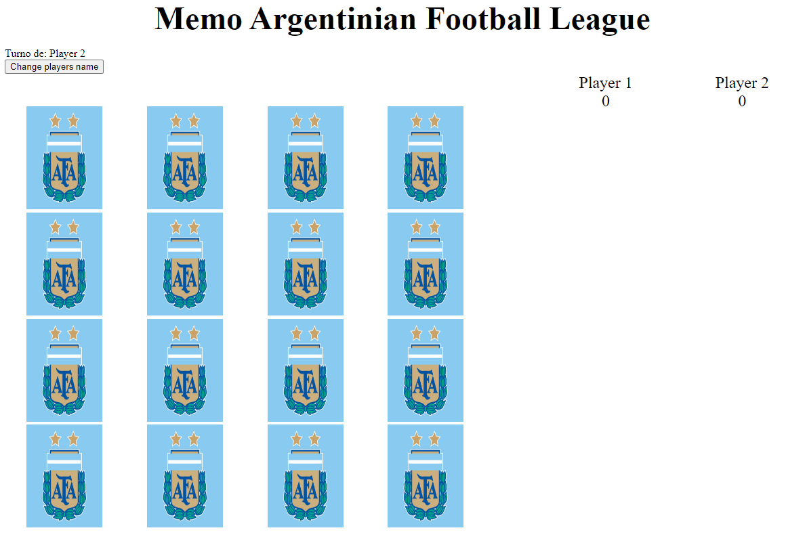
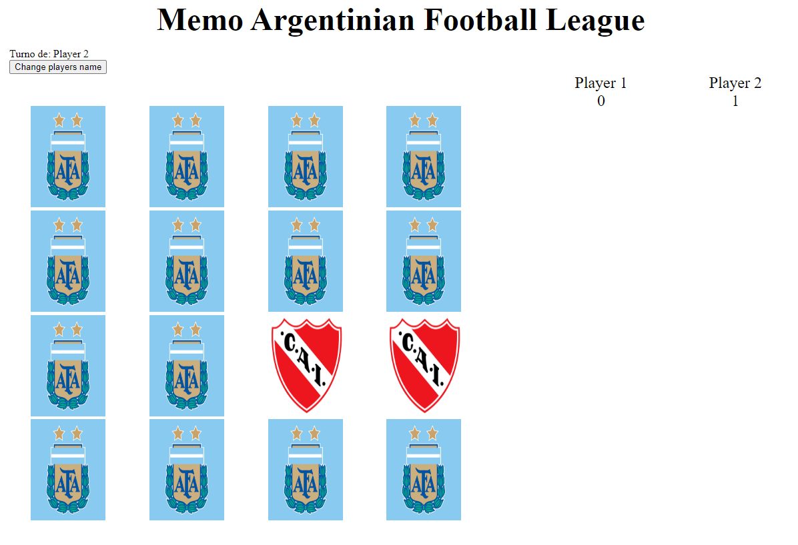
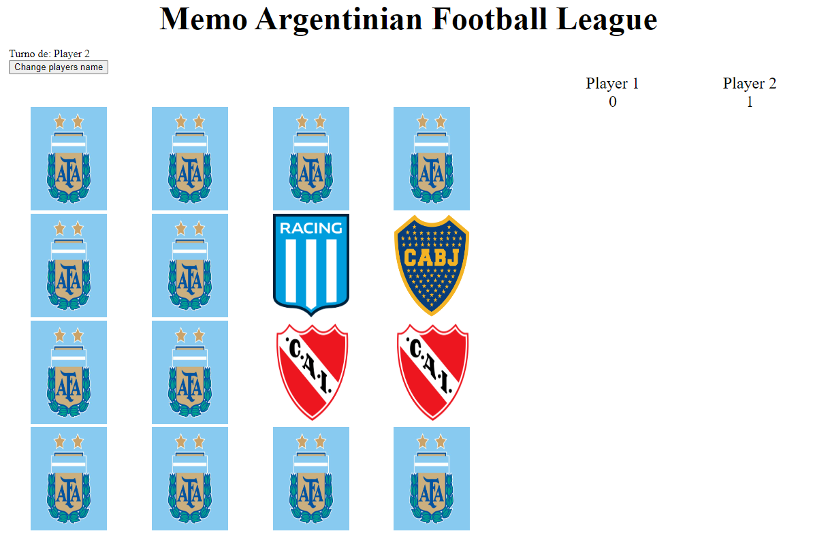
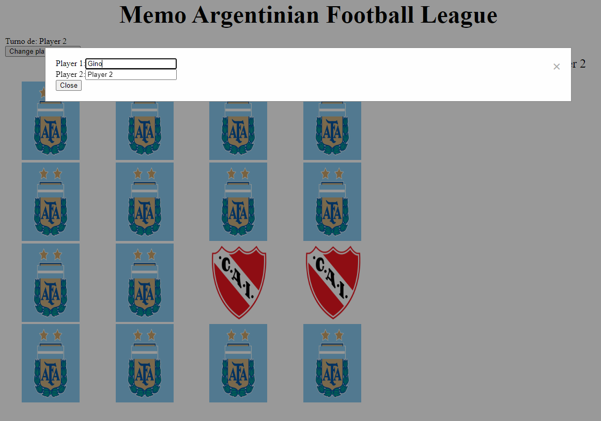

# Memoligarg

## About

This is A memory card game with Argentinian Football clubs logos. 

A memory card game involves a set of cards with matching pairs of images or patterns. The cards are placed face down, and players take turns flipping over two cards at a time, aiming to find matching pairs. If a pair is found, the player keeps it; otherwise, the cards are turned face down again. The game continues until all pairs are matched. It's a simple yet effective way to enhance memory and concentration skills.

## How to play?

1. Setup:
* Use a deck of cards with matching pairs of images or patterns.
* Place the cards face down in a grid.

2. Player Turns:
* Players take turns flipping over two cards at a time.
* The goal is to find matching pairs.

3. Matching Pairs:
* If the two flipped cards match, the player keeps the pair and gets another turn.
* If the cards don't match, they are turned face down again.

4. End of the Game:
* The game continues until all pairs are found and no more face-down cards remain.
* The player with the most pairs at the end wins.

## Where can you play?

There is a version deployed in CloudFlare:
* https://memoligarg.pages.dev/

## Screenshots

### Starting the game

### Matching cards

### Missing turn

### Changing player names

## Goal

My goal was to build a project to demostrate my knowledge in Javascript and NextJS, this is a migration of [Memoligarg by rlgino](https://github.com/rlgino/memoligarg) where you can play an old version in [MemoLigArg](https://memoligarg.vercel.app/)